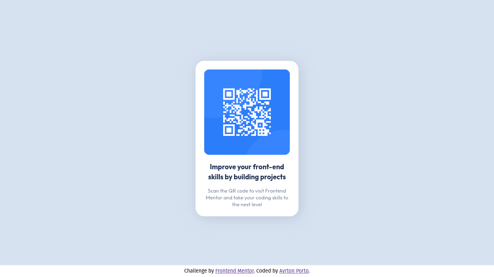

# Frontend Mentor - QR code component solution

Essa é uma solução para o [QR code component challenge on Frontend Mentor](https://www.frontendmentor.io/challenges/qr-code-component-iux_sIO_H). 
Os desafios encontrados no Frontend Mentor desenvolvem habilidades ao criar projetos reais. 

## Índice

- [Visão geral](#visão-geral)
  - [Imagens](#imagens)
  - [Links](#links)
- [Meu processo](#meu-processo)
  - [Ferramentas utilizadas](#ferramentas-utilizadas)
- [Autor](#autor)

## Visão geral

### Imagens

#### PC (1440px)

#### Mobile (375px)

### Links

- URL da solução (Código): [Este repositório](https://github.com/Ikusa0/QRCodeComponent)
- URL do site em produção: [Github Pages](https://ikusa0.github.io/QRCodeComponent/)

## Meu processo

### Ferramentas utilizadas

- HTML5 semântico
- CSS
- Flexbox
- Metodologia Mobile-First

## Autor

- Website - [Github](https://github.com/Ikusa0)
- Frontend Mentor - [@Ikusa0](https://www.frontendmentor.io/profile/Ikusa0)
- LinkedIn - [Ayrton Porto](https://www.linkedin.com/in/ayrton-porto/)
